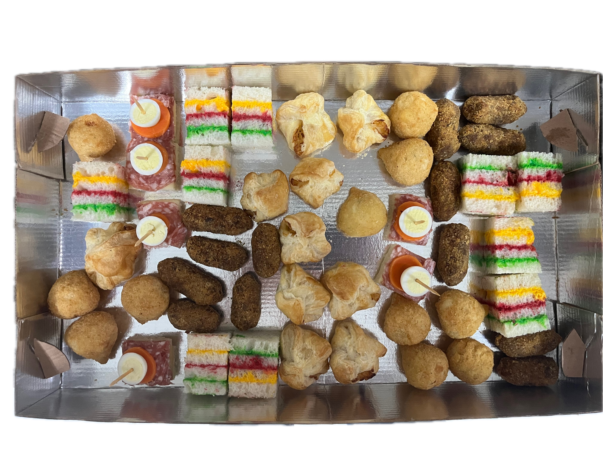
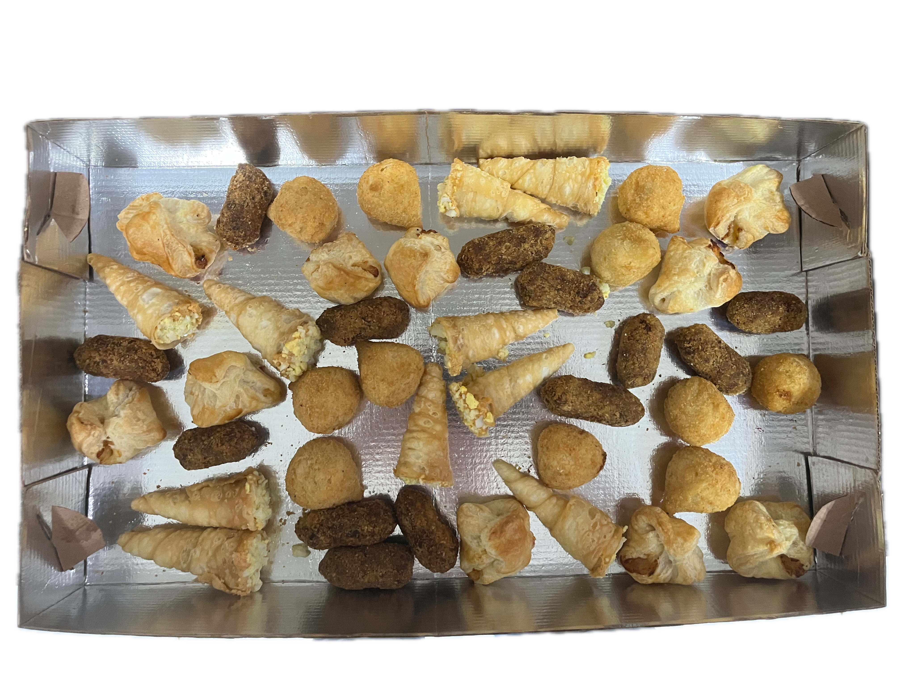
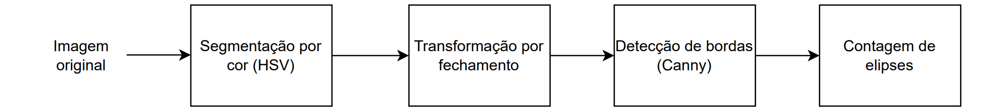
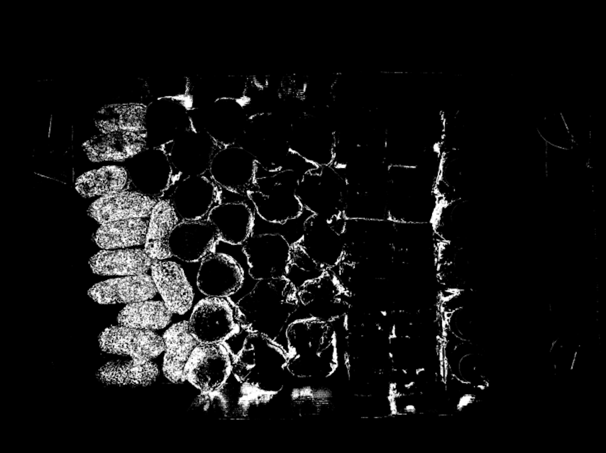
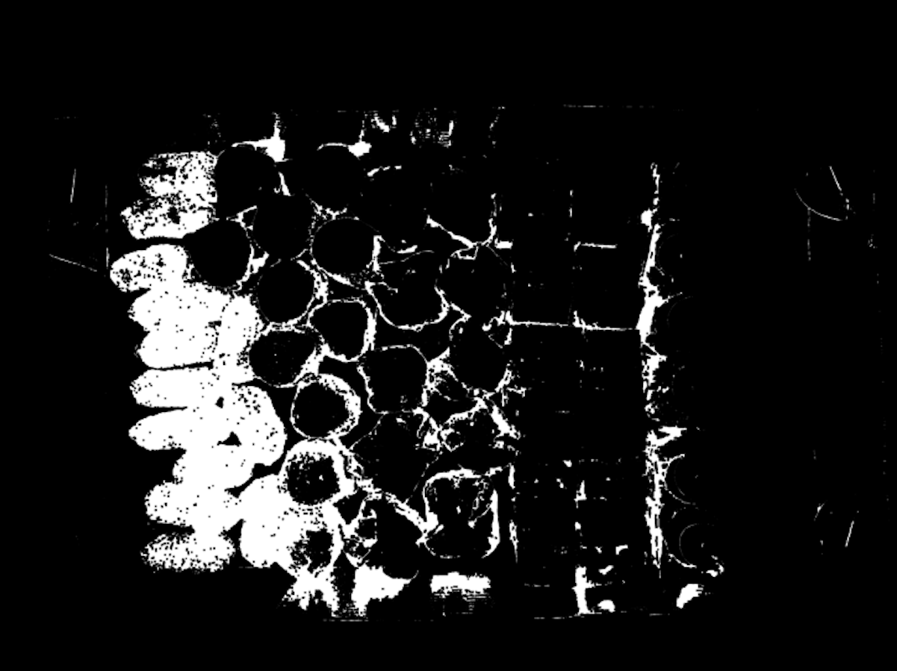
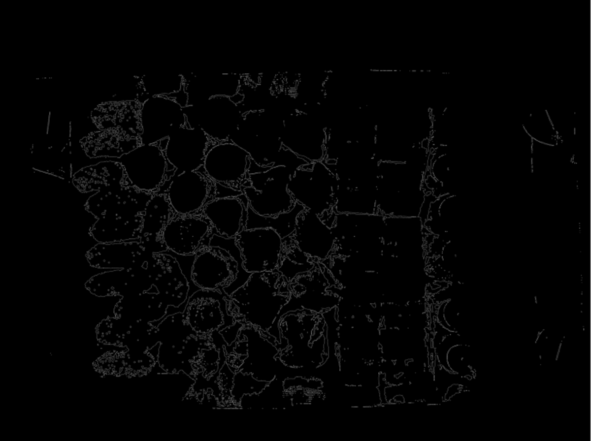

# Contagem de salgadinhos sortidos em caixas mistas

* **Vicente Knobel (202505144)**
* **Luiz Gustavo Coutinho Xavier (201905959)**

## Descrição do problema
O problema escolhido para atividade consiste na identificação de salgadinhos em caixas sortidas, adotando como exemplo encomendas de salgados produzidas por uma padaria local. Apesar de considerar a produção de um comércio específico, o problema estende-se a indústria de alimentos de modo geral, ao permitir a separação de encomendas de forma mais ágil assegurando controle de qualidade, especialmente em períodos de maior demanda de produção. Caixas sortidas são usualmente encomendadas com 4 ou 5 classes de salgados distintos, e possuem um tamanho padrão para conter um máximo de até 100 salgados. Para o escopo de problema definido neste trabalho, considera-se a existência das seguintes classes:

* Croquete de carne
* Coxinha de frango
* Empada folhada
* Sanduíche colorido
* Sanduíche aberto (canapé de salame com palito acima)
* Canudinho

É importante destacar a similaridade entre classes de salgadinhos no que diz respeito a sua cor e formato, o que representa um maior desafio na resolução do problema. Croquetes de carne apesar de majoritariamente marrons, possuem pigmentos pastéis da mesma cor das coxinhas devido a farinha utilizada em sua fabricação. Coxinhas e empadas também possuem grande similaridade de formato e cor.

As imagens do dataset se encontram disponíveis no diretório **/dataset**, totalizando 21 imagens. Diversas combinações de organizações com as seis classes de salgadinhos foram exploradas, incluindo organizações mais simples com somente uma classe. As imagens foram capturadas em alta resolução ($4032 \times 3024$) por uma câmera de celular

| | |
|---|---|
|  |  |
|  |  |

## Solução com visão clássica
Como primeira solução, foi implementado um pipeline simples de processamento de imagem utilizando algoritmos clássicos de visão computacional com o objetivo de identificar uma classe de salgadinhos por vez. A primeira etapa deste pipeline consiste em uma segmentação por cor criando-se uma máscara binária para os valores de pixels dentro de uma faixa de valores em HSV, utilizando da função `cv2.inRange`. Na segunda etapa é realizada uma transformação no domínio do espaço de fechamento, que consiste na aplicação em sequência de uma operação morfológica de dilatação (ie copiar pixel sempre que encontrados pelo kernel convolucional) seguida de uma erosão (ie copiar pixel para imagem resultante somente quando igual a totalidade do kernel). Essa transformação tem como objetivo preencher buracos detectados após aplicação da máscara binária preservando a imagem em seu tamanho original. Como terceira etapa, foi aplicado um leve borramento na imagem `cv2.bilateralFilter` para em sequencia aplicar o algoritmo de detecção de bordas de Canny (`cv2.Canny`). Como última etapa é realizada uma contagem direta de elipses sobre os objetos remanescentes representando os salgadinhos da classe escolhida.

Nesta primeira iteração não foi possível isolar os salgadinhos desejados com uma acurácia satisfatória, isto é, identificar somente os salgadinhos da classe escolhida sem resquícios de sombra ou pedaços de outros elementos. Como ilustrado, na tentativa de identificar salgadinhos do tipo Croquete, acabávamos sempre com resquícios de outros elementos após a segmentação de cor. Os melhores resultados foram obtidos com a faixa de valores HSV [8, 130, 10] e [24, 180, 140]. Mesmo após a execução em sequência do fechamento na intenção de preencher os buracos, a detecção de bordas por Canny não contornou elipses perfeitas. Idealmente pensou-se que este capaz de identificar as bordas de somente a classe de salgadinhos segmentadas, para que então em uma última etapa fosse possível realizar uma contagem direta de elipses, os únicos objetos remanescentes representando os salgadinhos da classe croquete.

| | |
|---|---|
|  |  |
|  |  |

## Solução com Yolo
